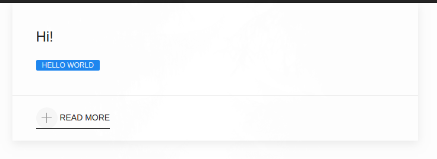

# Nuxt Vuikit

[](https://travis-ci.org/TiagoDanin/Nuxt-Vuikit) [](https://npmjs.org/package/nuxt-vuikit) [](https://npmjs.org/package/nuxt-vuikit) [](https://npmjs.org/package/nuxt-vuikit) [](https://github.com/xojs/xo) 

Vuikit Module for Nuxt.js

<p align="center"></p>

## Installation

Module available through the [npm registry](https://www.npmjs.com/). It can be installed using the [`npm`](https://docs.npmjs.com/getting-started/installing-npm-packages-locally) or [`yarn`](https://yarnpkg.com/en/) command line tool.

```sh
# Yarn (Recomend)
yarn add nuxt-vuikit
# NPM 
npm install nuxt-vuikit --save
```

## Documentation

### Setup

- Add `nuxt-vuikit` to `modules` section of your `nuxt.config.js`

```js
{
	modules: [
		'nuxt-vuikit'
	],
	vuikit: {
		defaultTheme: true,
		icons: true
	}
}
```

### Module options

#### `defaultTheme`
Load UiKit3 default theme
- Default: `true`
- Type: `Boolean`

#### `icons`
Load UiKit3 icons
- Default: `true`
- Type: `Boolean`

## Tests

To run the test suite, first install the dependencies, then run `test`:

```sh
# Using Yarn
yarn test
```

## Dependencies

<details>
	<summary><a href="https://ghub.io/@vuikit/icons">@vuikit/icons</a>: UIkit icons as Vue functional components</summary>
	<b>Author</b>: Miljan Aleksic</br>
	<b>License</b>: MIT</br>
	<b>Version</b>: ^0.8.1
</details>
<details>
	<summary><a href="https://ghub.io/@vuikit/theme">@vuikit/theme</a>: Vuikit default theme based on UIkit</summary>
	<b>Author</b>: Miljan Aleksic</br>
	<b>License</b>: MIT</br>
	<b>Version</b>: ^0.8.1
</details>
<details>
	<summary><a href="https://ghub.io/debug">debug</a>: small debugging utility</summary>
	<b>Author</b>: TJ Holowaychuk</br>
	<b>License</b>: MIT</br>
	<b>Version</b>: ^4.1.1
</details>
<details>
	<summary><a href="https://ghub.io/vuikit">vuikit</a>: A responsive Vue UI library for web site interfaces based on UIkit</summary>
	<b>Author</b>: Miljan Aleksic</br>
	<b>License</b>: MIT</br>
	<b>Version</b>: ^0.8.10
</details>

## Dev Dependencies

<details>
	<summary><a href="https://ghub.io/ava">ava</a>: Node.js test runner that lets you develop with confidence.</summary>
	<b>Author</b>: novemberborn, sindresorhus, vdemedes</br>
	<b>License</b>: MIT</br>
	<b>Version</b>: ^3.8.2
</details>
<details>
	<summary><a href="https://ghub.io/got">got</a>: Human-friendly and powerful HTTP request library for Node.js</summary>
	<b>Author</b>: sindresorhus, szmarczak</br>
	<b>License</b>: MIT</br>
	<b>Version</b>: ^11.1.4
</details>
<details>
	<summary><a href="https://ghub.io/nuxt">nuxt</a>: A minimalistic framework for server-rendered Vue.js applications (inspired by Next.js)</summary>
	<b>Author</b>: atinux, pi0</br>
	<b>License</b>: MIT</br>
	<b>Version</b>: ^2.12.2
</details>
<details>
	<summary><a href="https://ghub.io/vue">vue</a>: Reactive, component-oriented view layer for modern web interfaces.</summary>
	<b>Author</b>: Evan You</br>
	<b>License</b>: MIT</br>
	<b>Version</b>: ^2.6.11
</details>
<details>
	<summary><a href="https://ghub.io/xo">xo</a>: JavaScript/TypeScript linter with great defaults</summary>
	<b>Author</b>: Sindre Sorhus</br>
	<b>License</b>: MIT</br>
	<b>Version</b>: ^0.30.0
</details>

## Contributors

Pull requests and stars are always welcome. For bugs and feature requests, please [create an issue](https://github.com/TiagoDanin/Nuxt-Vuikit/issues). [List of all contributors](https://github.com/TiagoDanin/Nuxt-Vuikit/graphs/contributors).

## License

[MIT](LICENSE) © [Tiago Danin](https://TiagoDanin.github.io)